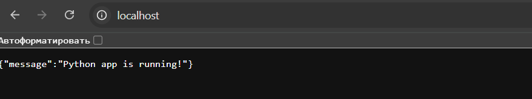

# Mongo: Развёртывание приложения с Docker

Этот проект демонстрирует развёртывание Python-приложения с интеграцией различных сервисов с использованием Docker и Docker Compose. Включает настройку многоконтейнерной среды с MongoDB для хранения данных, Nginx в качестве обратного прокси, Redis для кэширования, и Python-приложение для обработки логики.

## Возможности

- **Nginx**: Обратный прокси и балансировщик нагрузки.
- **Python-приложение**: Основная логика приложения, подключение к MongoDB и Redis.
- **MongoDB**: Хранилище данных с настройкой репликации для повышения доступности.
- **Redis**: Хранилище данных в оперативной памяти для кэширования и обработки сообщений.

## Структура проекта

```
project-root/
├── app/
│   ├── app.py           # Точка входа Python-приложения
│   ├── requirements.txt # Зависимости Python
├── nginx/
│   ├── nginx.conf       # Конфигурационный файл Nginx
├── docker-compose.yml   # Файл для настройки многоконтейнерной среды
└── README.md            # Документация проекта
```

## Начало работы

### 1. Клонирование репозитория

```bash
git clone https://github.com/denzel-voin/mongo.git
cd mongo
```

### 2. Настройка переменных окружения

Создайте файл `.env` в корневой папке проекта для указания переменных окружения:

```
MONGO_INITDB_ROOT_USERNAME=root
MONGO_INITDB_ROOT_PASSWORD=example
REDIS_HOST=redis
REDIS_PORT=6379
```

### 3. Сборка и запуск контейнеров

Выполните следующую команду для сборки образов и запуска контейнеров:

```bash
docker-compose up -d
```

### 4. Инициализация репликации MongoDB

Подключитесь к основному контейнеру MongoDB и выполните команду для инициализации репликации:

```bash
docker exec -it mongo1 mongosh --eval "rs.initiate()"
docker exec -it mongo1 mongosh --eval "rs.add('mongo2')"
```

### 5. Доступ к приложению

Приложение будет доступно по адресу `http://localhost`.


- Проверка методов `Post` и `GET`


### 6. Остановка контейнеров

Для остановки и удаления контейнеров выполнить:

```bash
docker-compose down
```

## Обзор сервисов

| Сервис        | Порт  | Описание                     |
|---------------|-------|------------------------------|
| Nginx         | 80    | Обратный прокси для приложения|
| Python App    | 5000  | Логика backend-приложения    |
| MongoDB (1)   | 27017 | Основной экземпляр базы данных |
| MongoDB (2)   | 27017 | Вторичный экземпляр базы данных |
| Redis         | 6379  | Кэширование и обмен сообщениями |
